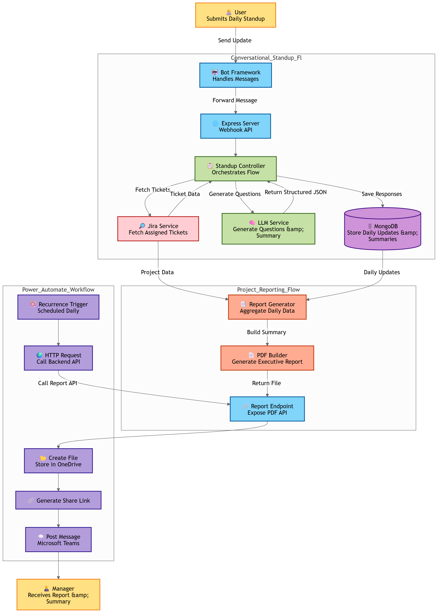

# DailyFlow AI

An AI-powered Jira Standup & Project Reporting System that:

- Collects daily standup updates via Microsoft Bot Framework  
- Stores structured responses in MongoDB  
- Generates executive-level summaries using LLM  
- Builds project-level PDF reports  
- Automatically sends reports to managers via Microsoft Teams using Power Automate  

This project demonstrates a production-oriented architecture integrating conversational AI, Jira APIs, structured persistence, PDF generation, and enterprise workflow automation.

---

# 🚀 System Overview

The system performs two major responsibilities:

## 1️⃣ Conversational Standup Collection

- Identifies the user  
- Fetches assigned Jira tickets  
- Collects structured daily updates  
- Stores responses in MongoDB  
- Generates executive summary using LLM  

## 2️⃣ Automated Project-Level Reporting

- Fetches daily Jira activity per project  
- Aggregates data into project summary  
- Generates structured PDF report  
- Power Automate sends the report directly to manager via Microsoft Teams  

---

# 🏗 Architecture


## Core Components

- **Express Server** – Hosts bot and reporting endpoints  
- **Bot Framework Adapter** – Handles conversation processing  
- **Jira Service** – Fetches and normalizes Jira ticket data  
- **LLM Service** – Generates contextual questions and summaries
- **MongoDB Layer** – Stores tickets, daily updates, and summaries  
- **Report Generator** – Creates project-level PDF reports  
- **Power Automate Flow** – Delivers report to manager on Teams  

---

# 🔄 End-to-End Flow

## A) Standup Flow

User → Bot Framework → Jira Service → LLM Service → MongoDB → Executive Summary


## B) Automated Reporting Flow

Jira → Report Generator → PDF File → HTTP Endpoint → Power Automate →  
Create File → Generate Share Link → Post Message in Microsoft Teams

---

# 📁 Project Structure

```
Bot-Hackathon/
│
├── models/
│   ├── DailyUpdate.js
│   ├── ProjectSummary.js
│   └── Ticket.js
│
├── services/
│   ├── jiraService.js
│   ├── llmService.js
│   └── summaryService.js
│
├── report/
│   └── report_generator.js
│
├── reports/                 # Generated PDF reports are stored here
│
├── Architecture_Diagram.png  # System architecture diagram
├── index.js                 # Application entry point
├── mongodb.js               # MongoDB connection
├── .env.example
├── .gitignore
├── package.json
└── package-lock.json
```

---

# 🧠 Data Models

### Ticket
Stores normalized Jira ticket metadata.

### DailyUpdate
Stores per-user daily standup responses.

### ProjectSummary
Stores aggregated project-level summary data.

---

# 📦 Installation

Clone the repository and install dependencies:

```bash
git clone <repository-url>
cd Bot-Hackathon
npm install
```
## ⚙ Environment Setup

Create a `.env` file in the root directory:

```
MONGO_URI=your_mongodb_connection_string

JIRA_DOMAIN=your_jira_domain
JIRA_EMAIL=your_jira_email
JIRA_API_TOKEN=your_jira_api_token

GROQ_API_KEY=your_llm_api_key
```

## ▶ Running the Application

The application entry point is `index.js`.

Start the server using:

```bash
npm start
```

Server runs at:

```
http://localhost:3978
```

---

## 🔌 Available Endpoints

### Bot Webhook

```
http://localhost:3978/api/messages
```

Used by Microsoft Bot Framework to process user conversations.

---


### Manual Summary Trigger

```
http://localhost:3978/generate-daily-summary
```

Triggers daily project summary generation.

---

## 📊 Report Generation Module

The `report/report_generator.js` module is responsible for generating the project-level daily report.

It performs the following steps:

- Fetches Jira tickets per project  
- Filters today's activity  
- Calculates:
  - Completed tickets  
  - In-progress tickets  
  - Story points  
  - Blockers  
- Builds structured project summary  
- Converts summary into PDF  
- Saves the generated file inside the `/reports` directory  

### Report Endpoint (Manual Trigger)

```
http://localhost:3978/getReport
```
You can manually generate and view the report in the browser 

---

# 📄 PDF Report Includes

- Project name  
- Report date  
- Overall status  
- Completion percentage  
- Tickets completed today  
- Tickets in progress  
- Blockers (if any)  
- Key accomplishments  

The PDF is generated automatically and made available for distribution.

---

## 🔁 Power Automate Integration

The reporting workflow is automated using Microsoft Power Automate.

### Trigger:
- Recurrence Trigger (Scheduled Daily Execution)

### Flow:

1. Recurrence Trigger (Runs at scheduled time)
2. HTTP Request → Calls `/getReport`
3. Create File (OneDrive / SharePoint)
4. Generate Share Link
5. Post Message in Microsoft Teams

The manager automatically receives:

- Summary message  
- Shareable PDF link  

This eliminates manual daily reporting.


